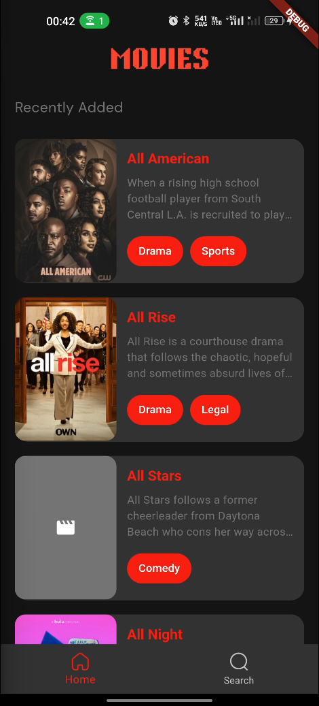
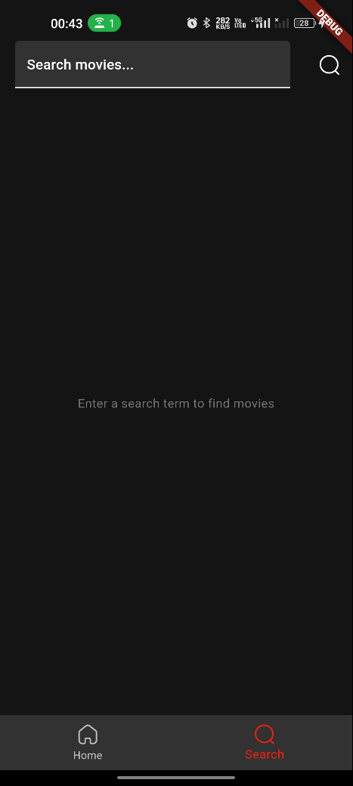
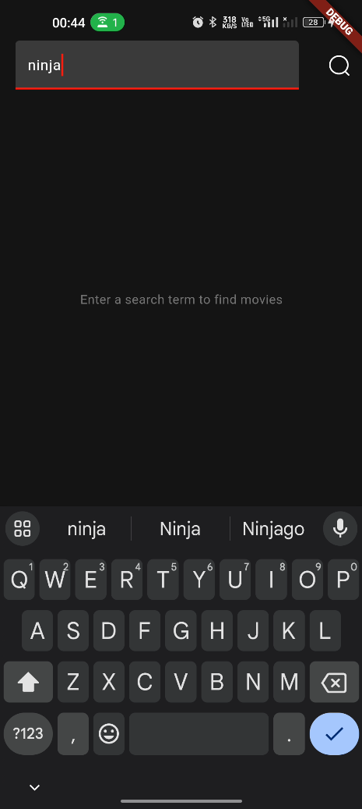
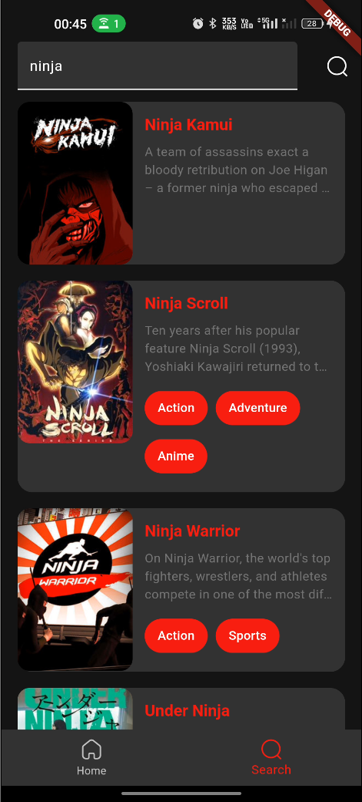

# Flutter Movie App

[](https://flutter.dev/)
[](https://dart.dev/)

A feature-rich movie application built using Flutter that allows users to browse a list of movies, search for specific movies, and view detailed information about each movie. The app includes a responsive dark theme, a clean UI design, and state management with Flutter Bloc.

## ⚡️ Features

- **Movie List**: Displays a list of movies fetched from an API.
- **Search Functionality**: Users can search for specific movies by entering a query.
- **Movie Details**: Detailed view of movies, including the title, genres, and summary.
- **Dark Mode UI**: App is styled with a dark theme for a visually pleasing experience.
- **Navigation**: Includes bottom navigation for switching between the Home and Search pages.

## Screenshots

<table>
  <tr>
    <td></td>
    <td></td>
    <td></td>
    <td></td>
  </tr>
  <tr>
    <td></td>
    <td></td>
  </tr>
</table>

## 👩‍💻 Technologies Used

- **Flutter**: Framework for building the UI and managing app logic.
- **Flutter Bloc**: For state management (Event-Driven Architecture).
- **REST API**: Used to fetch movie data.
- **Google Fonts**: Integrated custom fonts for a modern design.
- **Custom Widgets**: Reusable components such as `MovieCard`.

## 🚀 Getting Started

### Prerequisites

- Flutter SDK
- Dart SDK
- Android Studio / VS Code

### Installation

1. Clone the repository:
   ```
   git clone https://github.com/SanjayKParida/flutter-movie.git
   ```
2. Navigate to the project directory:
   ```
   cd flutter-movie
   ```
3. Install dependencies:
   ```
   flutter pub get
   ```
4. Run the app:
   ```
   flutter run
   ```

## Project Structure

The project follows a clean architecture approach with distinct layers for `data`, `domain`, and `presentation`. Below is the folder structure:

```
lib/
├── core/                            # Core module for app-wide utilities and theming
│   ├── theme/
│   │   └── app_theme.dart           # Centralized theme configurations
│
├── features/                        # Features module
│   ├── movies/                      # Movie-related functionality
│   │   ├── data/                    # Data layer (API integration and data models)
│   │   │   ├── data_sources/
│   │   │   │   └── remote_data_source.dart  # Handles remote API calls
│   │   │   ├── models/
│   │   │   │   └── movie_model.dart         # Defines the data model for movies
│   │   │   ├── repositories/
│   │   │       └── movie_repository_impl.dart  # Repository implementation for movies
│   │   │
│   │   ├── domain/                  # Domain layer (business logic and use cases)
│   │   │   ├── entities/
│   │   │   │   └── movie_entity.dart         # Defines core movie entity
│   │   │   ├── repositories/
│   │   │   │   └── movie_repository.dart    # Abstract repository contract
│   │   │   ├── usecases/
│   │   │       ├── get_all_movies.dart      # Use case to fetch all movies
│   │   │       └── search_movies.dart       # Use case to search movies
│   │   │
│   │   ├── presentation/            # Presentation layer (UI and state management)
│   │   │   ├── bloc/                # Bloc for managing state
│   │   │   │   ├── movie_bloc.dart          # Handles movie state transitions
│   │   │   │   ├── movie_event.dart         # Defines all movie events
│   │   │   │   └── movie_state.dart         # Defines all movie states
│   │   │   ├── pages/               # Pages in the app
│   │   │   │   ├── details_page.dart        # Details page for a single movie
│   │   │   │   ├── home_page.dart           # Home page showing movie list
│   │   │   │   ├── search_page.dart         # Search page with search functionality
│   │   │   │   └── splash_page.dart         # Splash screen for the app
│   │   │   ├── widgets/             # Reusable widgets
│   │   │       ├── bottom_navigation.dart   # Bottom navigation bar
│   │   │       └── movie_card.dart          # Widget for displaying movie information
│
├── main.dart                         # Application entry point


```

## 🧠 Key Components

- **State Management**:
  Bloc Implementation:
  MovieBloc manages the state of the movie list and search results.
  Events like FetchAllMoviesEvent and SearchMoviesEvent trigger specific API calls.
- **Theming**: Centralized dark mode theme in AppTheme for consistent UI styling.
- **Navigation**: BottomNavigation widget allows seamless navigation between the Home and Search pages.

## Contact

Sanjay Kumar Parida - [kumarparidasanjay23@gmail.com](mailto:kumarparidasanjay23@gmail.com)

Project Link: [https://github.com/SanjayKParida/flutter-movie](https://github.com/SanjayKParida/flutter-movie)
